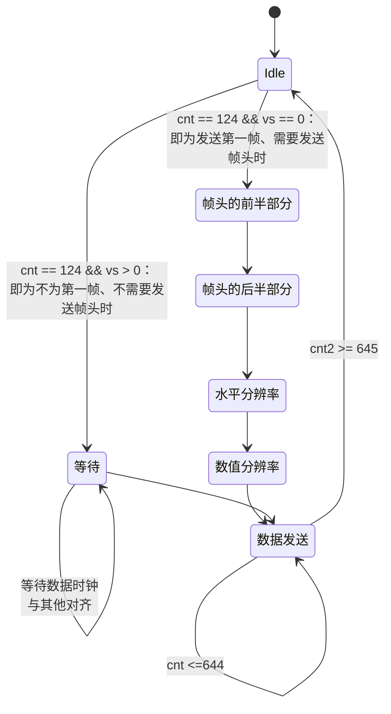

<!--
 * @Description: 
 * @Author: MALossov
 * @Date: 2023-11-16 15:05:06
 * @LastEditTime: 2023-11-16 15:05:43
 * @LastEditors: MALossov
 * @Reference: 
-->
## UDP MERMAID

### State Machine

```mermaid
stateDiagram-v2
    [*] --> Idle
    Idle --> 帧头的前半部分: cnt == 124 && vs == 0：<br>即为发送第一帧、需要发送帧头时
    Idle --> 等待: cnt == 124 && vs > 0：<br>即为不为第一帧、不需要发送帧头时
    帧头的前半部分 --> 帧头的后半部分
    帧头的后半部分 --> 水平分辨率
    水平分辨率 --> 数值分辨率
    数值分辨率 --> 数据发送
    等待 --> 等待:等待数据时钟</br>与其他对齐
    等待 --> 数据发送
    数据发送 --> 数据发送 : cnt <=644
    数据发送 --> Idle: cnt2 >= 645
```
